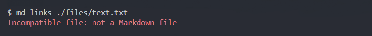
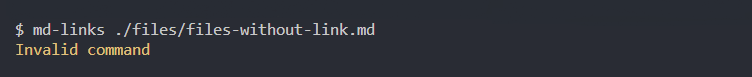
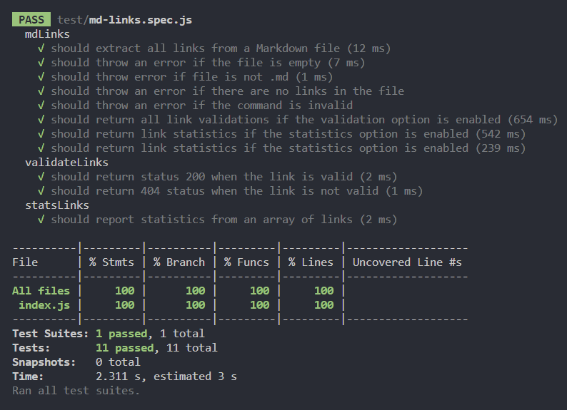

# Markdown Links

## Índice

* [1. Prefácio](#1-prefácio)
* [2. Fluxograma](#2-fluxograma)
* [3. Funcionalidades principais](#3-funcionalidades-principais)
* [4. Guia de instalação e uso](#4-guia-de-instalação-e-uso)
* [5. Testes unitários](#5-testes-unitários)
* [6. Critérios mínimos de aceitação](#6-critérios-mínimos-de-aceitação)
* [7. Tecnologias utilizadas](#7-tecnologias-utilizadas)
* [8. Autora](#8-autora)

***

## 1. Prefácio
`Markdown` é uma linguagem de marcação amplamente adotada por programadores. É empregada em diversas plataformas de manipulação de texto, como GitHub, fóruns e blogs. Arquivos nesse formato são comumente utilizados em qualquer repositório, a começar pelo tradicional `README.md`.

Desta forma, o propósito deste projeto é criar uma biblioteca capaz de ler arquivos Markdown usando uma interface de linha de comando (CLI). Isso permite que a biblioteca seja executada no terminal por meio de um módulo do Node.js. O módulo será responsável por ler arquivos no formato `Markdown ('.md')`, verificar se há links e fornecer estatísticas sobre esses links.

## 2. Fluxograma
Desenvolvi um fluxograma detalhado para facilitar o planejamento e a organização do projeto. Esse diagrama visual proporcionou uma visão clara das etapas e relações, otimizando a gestão do projeto. Com essa ferramenta, pude alcançar maior eficiência na execução das tarefas, garantindo um desenvolvimento mais estruturado e fluido.

<p>

</p>

## 3. Funcionalidades principais

- Realiza a leitura de arquivos **`Markdown ('.md')`** a partir da linha de comando;
- Extrai os links contidos nos arquivos **`Markdown ('.md')`**;
- Verifica o status HTTP dos links através da opção **`--validate`**;
- Fornece estatísticas sobre os links presentes nos arquivos utilizando a opção **`--stats`**;
- Ao utilizar as opções **`--stats`** e **`--validate`** em conjunto, você terá acesso a estatísticas minuciosas, que incluem o total de links presentes, a quantidade de links únicos e também o número de links quebrados.

## 4. Guia de instalação e uso
### 4.1. Instalação
Para instalar a biblioteca e começar a aproveitar os seus recursos, abra o terminal e execute o seguinte comando:

```
npm install md-links-iana-rodrigues
```

### 4.2. Uso
O Markdown Links oferece as seguintes funcionalidades:

**Extração de links** 

Para extrair os links de um arquivo `Markdown ('.md')` execute o seguinte comando:

```
md-links <caminho-do-arquivo>
```
<p>

</p>

**Validação de links**

Para validar os links de um arquivo `Markdown ('.md')` execute o seguinte comando:

```
md-links <caminho-do-arquivo> --validate
```
<p>

</p>

**Estatísticas de links**

Para gerar as estatísticas de um arquivo `Markdown ('.md')` execute o seguinte comando:

```
md-links <caminho-do-arquivo> --stats
```
<p>

</p>

**Validação e estatísticas de links**

Para validar os links e gerar as estatísticas de um arquivo `Markdown ('.md')` execute o seguinte comando: 

```
md-links <caminho-do-arquivo> --validate --stats
```
<p>

</p>

**Mensagens de erro**

Algumas mensagens de erro poderão aparecer nas seguintes situações:

Quando o arquivo não for `Markdown ('.md')`
<p>

</p>

- Quando o arquivo `Markdown ('.md')` estiver vazio
<p>

</p>

- Quando não tiver links para serem extraídos do arquivo `Markdown ('.md')`
<p>

</p>

- Quando o comando for inválido
<p>

</p>

## 5. Testes unitários
A aplicação foi concluída após a realização bem-sucedida de 11 testes, alcançando uma cobertura completa de 100%.
<p>

</p>

## 6. Critérios mínimos de aceitação
* [x] Poder instalar via ` npm install `;

* [x] Guia de uso e instalação da biblioteca;

* [x] Implementa `options.validate`;

* [x] Possuir o executável `md-links` no path (configurado no `package.json`);

* [x] Executar sem erros e ter o resultado esperado;

* [x] Implementar `--validate`;

* [x] Implementar `--stats`;

* [x] Os testes unitários devem cobrir no mínimo 70% dos statements, functions, lines e branches;

* [x] Rodar os testes (`npm test`).

## 7. Tecnologias utilizadas
- JavaScript
- Node.js
- GitHub
- Git Bash
- Whimsical

## 8. Autora
Iana Rodrigues -  [LinkedIn](https://www.linkedin.com/in/ianarodrigues/) | [GitHub](https://github.com/ianarodrigues) 